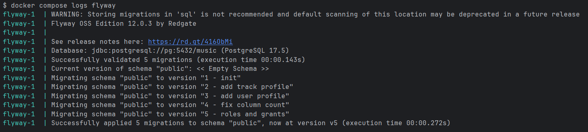
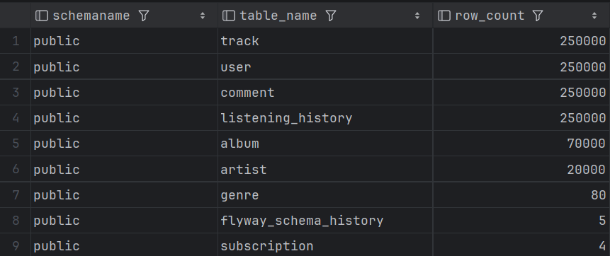

# itis_db

## 1. Миграции

В проекте добавлены миграции поверх `migrations/V1__init.sql`:
- `migrations/V2__add_track_profile.sql`
- `migrations/V3__add_user_profile.sql`
- `migrations/V4__fix_column_count.sql`
- `migrations/V5__roles_and_grants.sql`

### Соответствие требованиям

- Поля с высокой кардинальностью:
  - `track_profile.event_uuid` (`UUID UNIQUE`)
  - `user_profile.id` (`UUID PRIMARY KEY`)

- Поля с низкой кардинальностью:
  - `track_profile.moderation_status` (`CHECK`: `draft/published/blocked`)
  - `user_profile.status` (`CHECK`: `active/hidden/blocked`)

- Диапазонные значения:
  - `track_profile.popularity_window` (`INT4RANGE`)
  - `user_profile.engagement_window` (`INT4RANGE`)

- Полнотекстовые данные:
  - `track_profile.review_text` + GIN индекс `to_tsvector('russian', ...)`
  - `user_profile.bio` + GIN индекс `to_tsvector('russian', ...)`

- Массивы или JSONB:
  - `track_profile.extra_data` (`JSONB`)
  - `user_profile.preferences` (`JSONB`)

- Геометрические или range-типы:
  - Использованы range-типы `INT4RANGE`.

- Не менее 5–7 полей в каждой таблице:
  - `V4` добавляет недостающие поля в таблицы `subscription`, `genre`, `"like"`, `follow`.
  - После `V4` во всех таблицах схемы количество полей находится в диапазоне 5–7.

## 2. Поля новых таблиц

### track_profile

- `id` - первичный ключ записи профиля трека.
- `track_id` - ссылка на трек из таблицы `track`.
- `event_uuid` - уникальный внешний идентификатор события/профиля.
- `moderation_status` - статус модерации (`draft`, `published`, `blocked`).
- `popularity_window` - диапазон значений популярности (`INT4RANGE`).
- `review_text` - текст для полнотекстового поиска.
- `extra_data` - дополнительные метаданные в `JSONB`.

### user_profile

- `id` - UUID первичный ключ профиля пользователя.
- `user_id` - ссылка на пользователя из таблицы `"user"`.
- `status` - статус профиля (`active`, `hidden`, `blocked`).
- `engagement_window` - диапазон значений вовлеченности (`INT4RANGE`).
- `bio` - текстовое описание профиля для полнотекстового поиска.
- `preferences` - дополнительные настройки/предпочтения в формате `JSONB`.

## 3. Роли и права

Миграция `migrations/V5__roles_and_grants.sql` создает роли и назначает им права:

- `admin` - управление схемой и миграциями:
  - `USAGE`, `CREATE` на схему `public`
  - `ALL PRIVILEGES` на все текущие таблицы и последовательности
  - default privileges для будущих таблиц и последовательностей

- `app` - работа приложения с данными:
  - `SELECT`, `INSERT`, `UPDATE`, `DELETE` на все таблицы
  - `USAGE`, `SELECT` на все последовательности
  - default privileges для будущих таблиц и последовательностей

- `readonly` - только чтение данных:
  - `SELECT` на все таблицы
  - default privileges на чтение для будущих таблиц

## 4. Сиды (Python)

Скрипт сидирования: `seeds/seed.py`.

### Как запустить

1. Убедиться, что БД поднята и миграции применены.
2. Установить зависимости:
   - `pip install -r seeds/requirements.txt`
3. Запустить:
   - `python seeds/seed.py`

Параметры подключения и объёмы зафиксированы в начале `seeds/seed.py` константами.

### Что заливается

- Крупные таблицы по ~250 000 строк:
  - `"user"`
  - `track`
  - `listening_history`
  - `"comment"`
- Итого по крупным таблицам: 1 000 000 строк (минимум по заданию выполнен).
- Дополнительно заполняются справочники для FK: `subscription`, `genre`, `artist`, `album`.

### Соответствие требованиям генерации данных

- 3–4 таблицы по ~250 000 строк:
  - используется 4 таблицы: `"user"`, `track`, `listening_history`, `"comment"` по 250 000 строк.

- Общий объём не менее 1 млн строк:
  - суммарно 1 000 000 строк в крупных таблицах.

- Равномерное распределение (uniform):
  - `track.album_id`,
  - `album.genre_id`.

- Сильно неравномерное (skewed, Zipf-подобное):
  - `listening_history.track_id`,
  - `"comment".track_id`,
  - `album.artist_id`,
  - `track.genre_id`.

- Низкая селективность (3–5 уникальных значений):
  - `"user".country` (5 значений),
  - `listening_history.device` (4 значения).

- Высокая селективность (~90–100% уникальных):
  - `"user".email` (почти 100% уникальные),
  - `track.title` (практически уникальные).

- NULL в 5–20% строк:
  - `"user".country` ~10%,
  - `artist.country` ~12%,
  - `artist.description` ~20%,
  - `album.release_date` ~7%,
  - `track.duration_seconds` ~8%,
  - `listening_history.device` ~10%,
  - `"comment".content` ~15%.

- Реалистичный перекос (70% записей у 10% значений):
  - `listening_history.user_id`: 70% событий у топ-10% пользователей,
  - `"comment".user_id`: аналогичный перекос.

## Результат:

Миграции успешно применились:

Сиды успешно применились:

