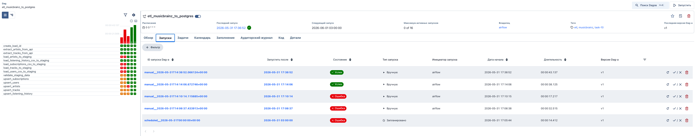
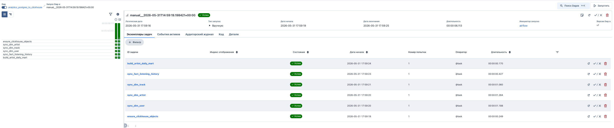
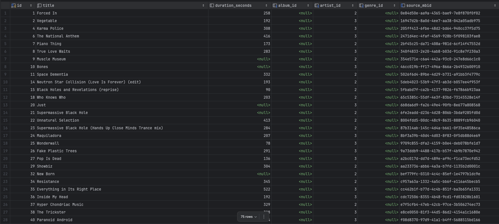
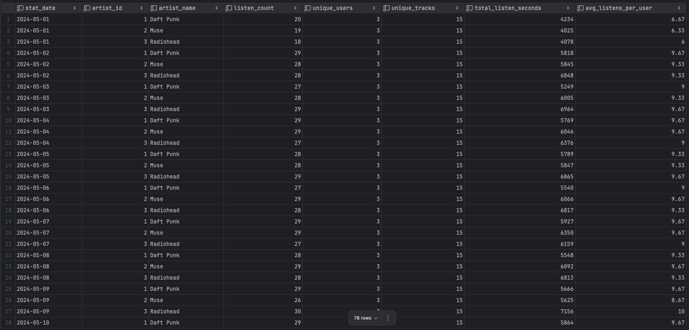

# Задание 10. Airflow ETL + Analytics

## Какие источники данных выбраны

В проекте используются два разных источника данных:

- `MusicBrainz API` как внешний источник для загрузки артистов и треков;
- вручную подготовленные `CSV`-файлы для загрузки подписок, пользователей и истории прослушиваний.

Файлы с входными данными лежат в [task-10/airflow/seeds](/task-10/airflow/seeds).

## Какие таблицы проекта пополняются

В основную PostgreSQL БД загружаются данные в таблицы:

- `subscription`
- `"user"`
- `artist`
- `track`
- `listening_history`

Также для ETL создан технический слой `staging`:

- `staging.stg_artists_api`
- `staging.stg_tracks_api`
- `staging.stg_subscriptions_csv`
- `staging.stg_users_csv`
- `staging.stg_listening_history_csv`

## Как устроен DAG 1

Файл DAG:

- [etl_musicbrainz_to_postgres.py](/task-10/airflow/dags/etl_musicbrainz_to_postgres.py)

Назначение DAG 1:

- загрузить данные из `MusicBrainz API` и `CSV` в PostgreSQL.

Этапы DAG 1:

1. Генерируется `load_id` для текущего запуска.
2. Из `artist_queries.json` читается список артистов.
3. По каждому артисту выполняется запрос в `MusicBrainz API`.
4. Артисты загружаются в `staging.stg_artists_api`.
5. По найденным артистам запрашиваются треки.
6. Треки загружаются в `staging.stg_tracks_api`.
7. Из `subscriptions.csv`, `users.csv` и `listening_history.csv` данные загружаются в staging-таблицы.
8. Выполняются проверки качества данных.
9. Выполняется `upsert` в боевые таблицы PostgreSQL.

Порядок загрузки в основные таблицы:

- `subscription`
- `"user"`
- `artist`
- `track`
- `listening_history`

Такой порядок нужен, потому что:

- пользователь зависит от подписки;
- трек зависит от артиста;
- событие прослушивания зависит от пользователя и трека.

## Как устроен DAG 2

Файл DAG:

- [analytics_postgres_to_clickhouse.py](/task-10/airflow/dags/analytics_postgres_to_clickhouse.py)

Назначение DAG 2:

- переложить данные из PostgreSQL в ClickHouse;
- построить аналитическую витрину.

Этапы DAG 2:

1. Создаются база и таблицы в ClickHouse.
2. Из PostgreSQL загружаются измерения:
- `dim_user`
- `dim_artist`
- `dim_track`
3. Из PostgreSQL загружается факт:
- `fact_listening_history`
4. На основе факта строится аналитическая витрина:
- `mart_artist_daily_stats`

## Какие таблицы создаются в ClickHouse

DDL лежит в файле:

- [clickhouse_ddl.sql](/task-10/airflow/sql/clickhouse_ddl.sql)

В ClickHouse создаются таблицы:

- `analytics.dim_user`
- `analytics.dim_artist`
- `analytics.dim_track`
- `analytics.fact_listening_history`
- `analytics.mart_artist_daily_stats`

## Какая аналитическая витрина построена

Построена витрина:

- `analytics.mart_artist_daily_stats`

Зерно витрины:

- `дата + артист`

Эта витрина показывает ежедневную активность пользователей по артистам.

## Какие метрики считаются

Во витрине считаются метрики:

- `listen_count` — количество прослушиваний;
- `unique_users` — количество уникальных пользователей;
- `unique_tracks` — количество уникальных треков;
- `total_listen_seconds` — суммарная длительность прослушанного контента;
- `avg_listens_per_user` — среднее число прослушиваний на одного пользователя.

## Как обеспечена идемпотентность

Идемпотентность обеспечивается через внешние ключи источников и `upsert`.

Используются такие бизнес-ключи:

- `artist.source_mbid`
- `track.source_mbid`
- `subscription.name`
- `"user".email`
- `listening_history.source_event_id`

В DAG 1 используются конструкции `INSERT ... ON CONFLICT DO UPDATE`, поэтому повторный запуск:

- не создаёт дубликаты;
- обновляет уже существующие записи;
- безопасно повторяет загрузку.

## Какие проверки качества данных реализованы

Перед загрузкой в таблицы выполняются проверки в staging:

- у артиста должны быть заполнены `name` и `source_mbid`;
- у трека должны быть заполнены `title` и `source_mbid`;
- у пользователя должны быть заполнены `email` и `username`;
- у события прослушивания должны быть заполнены `event_id`, `user_email`, `track_source_mbid`.

Кроме этого:

- `listening_history.csv` использует реальные `track_source_mbid`, которые уже пришли из API;
- при загрузке истории прослушиваний выполняется `JOIN` с `"user"` и `track`, что защищает от вставки событий с несуществующими ссылками.

## Как запустить проект

### 1. Поднять PostgreSQL и применить миграции

Из корня проекта:

```bash
docker compose up -d pg
docker compose up flyway
```

### 2. Поднять ClickHouse

```bash
docker compose up -d clickhouse
```

Параметры подключения к ClickHouse:

- host: `localhost`
- port: `8123`
- database: `analytics`
- user: `analytics`
- password: `analytics123`

### 3. Поднять Airflow

Перейти в каталог:

```bash
cd task-10/airflow
```

Запустить инициализацию и сервисы:

```bash
docker compose up airflow-init
docker compose up -d
```

Airflow UI:

- `http://localhost:8080`
- логин: `airflow`
- пароль: `airflow`

### 4. Запустить DAG 1

Сначала запускается:

- `etl_musicbrainz_to_postgres`

Он загружает:

- артистов и треки из `MusicBrainz API`;
- подписки, пользователей и историю прослушиваний из `CSV`.

### 5. Запустить DAG 2

После успешного выполнения DAG 1 запускается:

- `analytics_postgres_to_clickhouse`

Он переносит данные в ClickHouse и строит витрину `analytics.mart_artist_daily_stats`.

### 6. Результаты

**1. Оба DAG успешно выполнены**




**2. Треки загружены в PostgreSQL**



Аналогично с остальными таблицами

**3. Построена витрина данных в Clickhouse**

