# Задание 2

Для аналитики взял эти запросы:

```sql

-- 1) "="
SELECT id, title, duration_seconds
FROM track
WHERE title = 'Numb';

-- 2) ">"
SELECT id, title, duration_seconds
FROM track
WHERE duration_seconds > 240;

-- 3) LIKE 'prefix%'
SELECT id, username
FROM "user"
WHERE username LIKE 'alex%';

-- 4) LIKE '%substr%'
SELECT id, content
FROM "comment"
WHERE content LIKE '%music%';

-- 5) UPDATE with = + IN (Попробуем составной индекс)
UPDATE "comment"
SET content = content || ' [edited]'
WHERE user_id = 15
  AND track_id IN (51314, 98, 90867);
```

## 1. Запрос с "="

Без индекса: cost 5342, выполняется Parallel Seq Scan

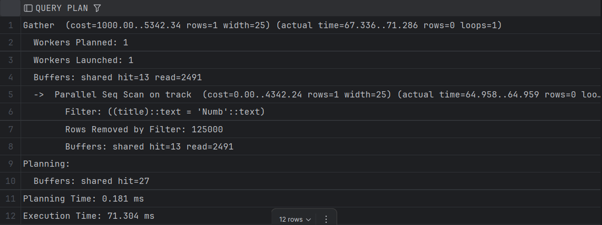

С BTREE индексом: cost 8.44, используется Index Scan

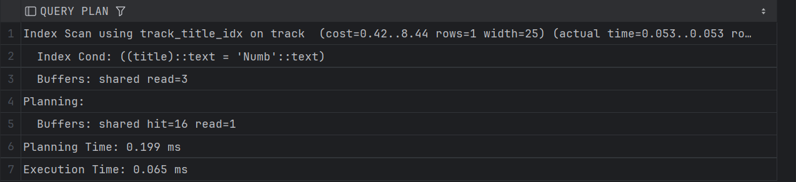

С HASH индексом: cost 8.02, используется Index Scan

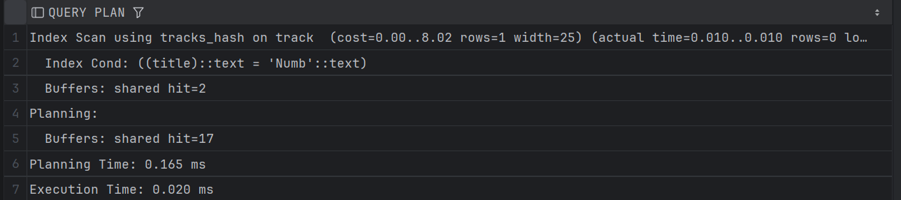

Вывод: HASH индекс незначительно выиграл BTREE в запросе с точным сравнением

## 2. Запрос с ">"

Без индекса: cost 5629, используется Seq Scan

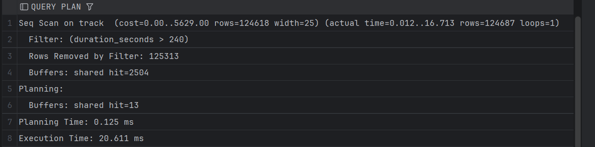

С BTREE: cost 5475, используется Bitmap Scan

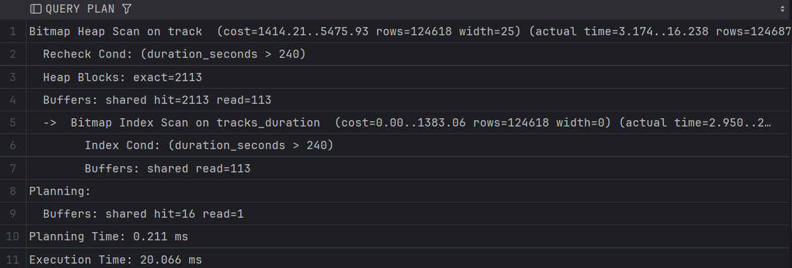

с HASH: cost 5629, используется Seq Scan

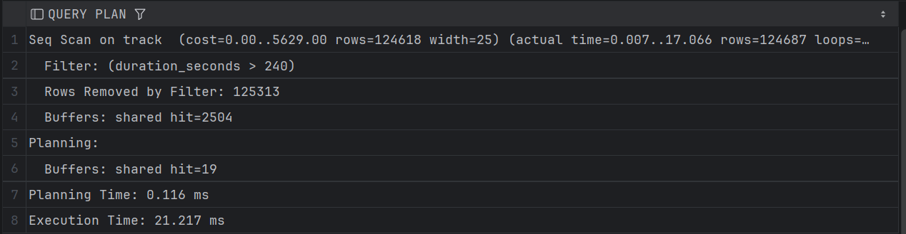

Вывод: BTREE быстрее в операциях с диапазоном (<, >, IN и т.д.), хоть и в этом примере выйгрыш был незначителен

## 3. Запрос с "like"

Без индекса: cost 5860, Parallel Seq Scan (Gather)

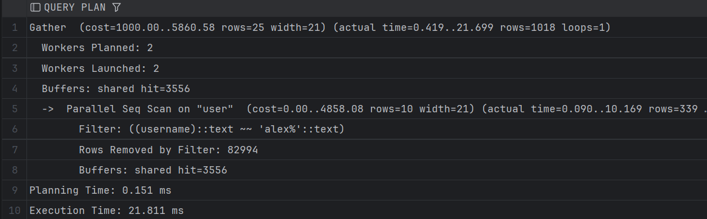

С BTREE: cost 5860, все равно выбрал Seq Scan

С HASH: аналогично

## 4. LIKE "%substr%"

Один результат для всех тестов, используется Parallel Seq Scan c cost 5932

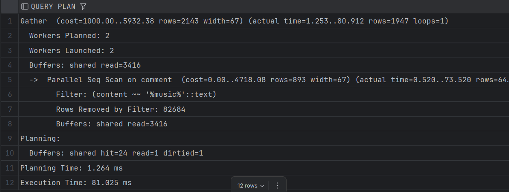

Вывод: BTREE и HASH не подходят для поиска по подстроке

## 5. "=" + "IN" (Составной индекс)

Без индекса: Seq Scan, cost 7478

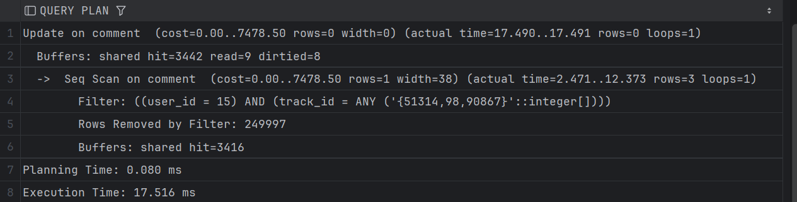

HASH (по user_id) - cost 23.55, используется Bitmap

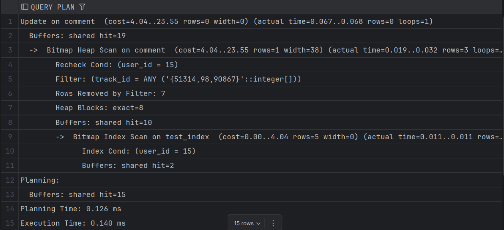

HASH (по track_id) - cost 215, используется Bitmap

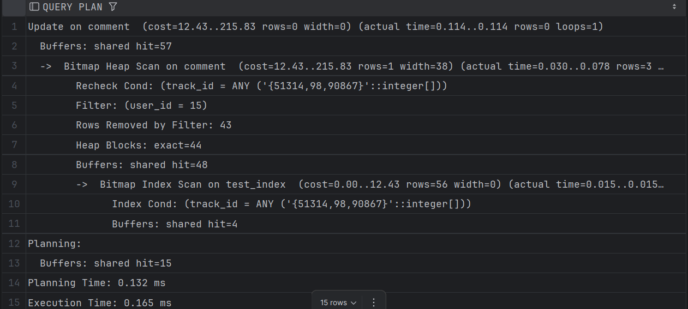

BTREE (по user_id) - cost 23.97, используется Bitmap

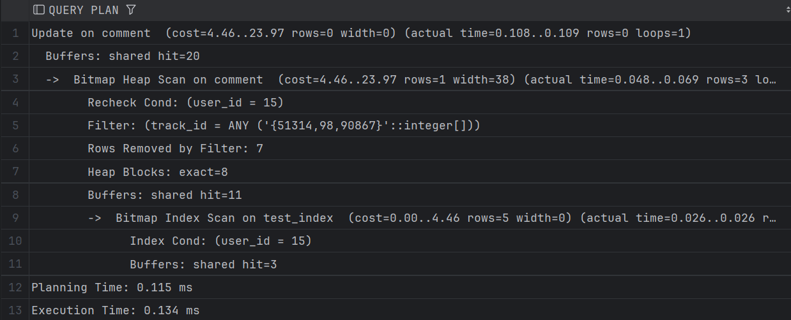

BTREE (user_id, track_id) - cost 17.3, Используется Index Scan

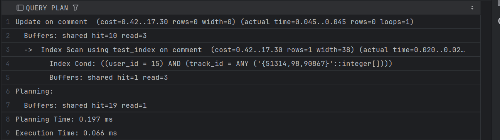

Выводы:
- Быстрее всех составной BTREE индекс
- BTREE незначительно проиграл HASH по столбцу user_id
- Нужно правильно выбирать столбец для индексации, HASH по track_id значительно проиграл HASH по user_id