# Дз 3

## GIN индексы

### 1 запрос

```sql
SELECT c.id, c.user_id, c.track_id, c.content
FROM comment c
WHERE to_tsvector('english', coalesce(c.content, ''))
      @@ websearch_to_tsquery('english', 'Hello');
```

Без индекса: cost 31884, Parallel Seq Scan
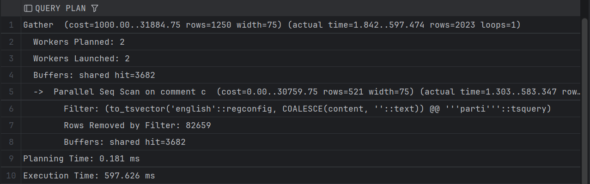

Добавляем GIN: cost 2811 (Bitmap)

```sql
CREATE INDEX IF NOT EXISTS idx_comment_content_fts_gin
    ON comment USING GIN (to_tsvector('english', coalesce(content, '')));
```
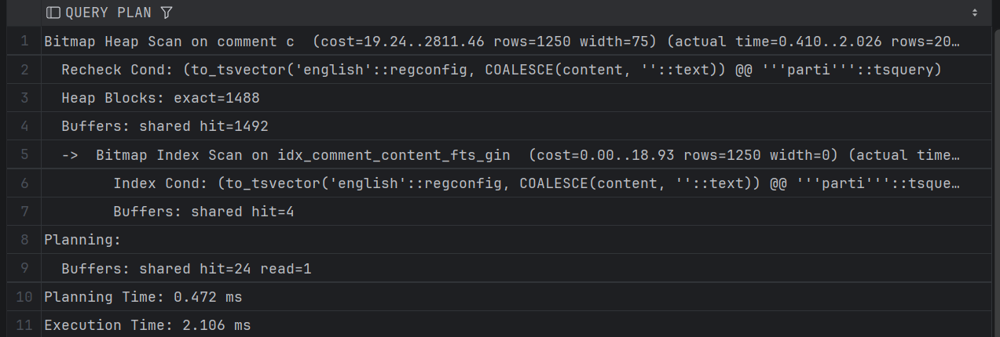

С Gist: 2842

### 2 запрос

```sql
SELECT u.id, u.username, u.email
FROM "user" u
WHERE u.username ILIKE '%amir%';
```

Без индекса: cost 6363 (Parallel Seq Scan)

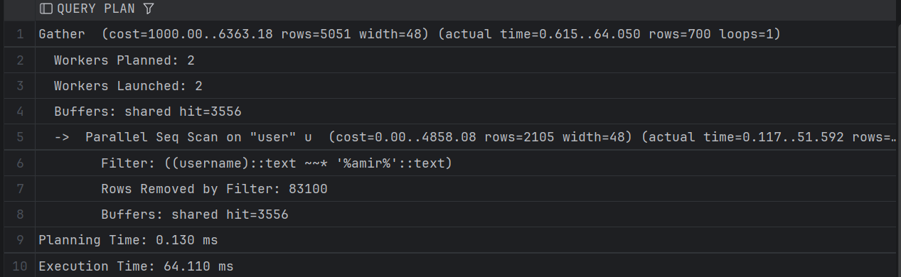

С Gin: 3862 (Bitmap)

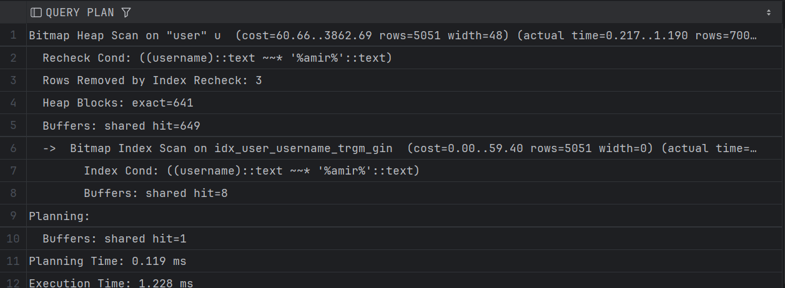

### 3) Поиск по JSONB в профиле пользователя (`user_profile.preferences`)

```sql
CREATE INDEX idx_user_profile_preferences_gin
    ON user_profile USING GIN (preferences);
```

```sql
SELECT up.id, up.user_id, up.preferences
FROM user_profile up
WHERE up.preferences @> '{"language":"ru","notifications":true}'::jsonb;
```

Без индекса: cost 11125 (Seq scan)

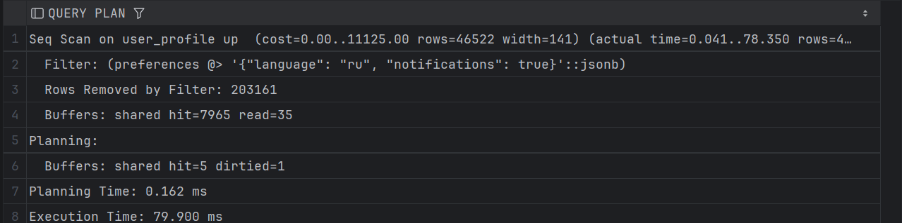

С индексом: cost 9119 (Bitmap)

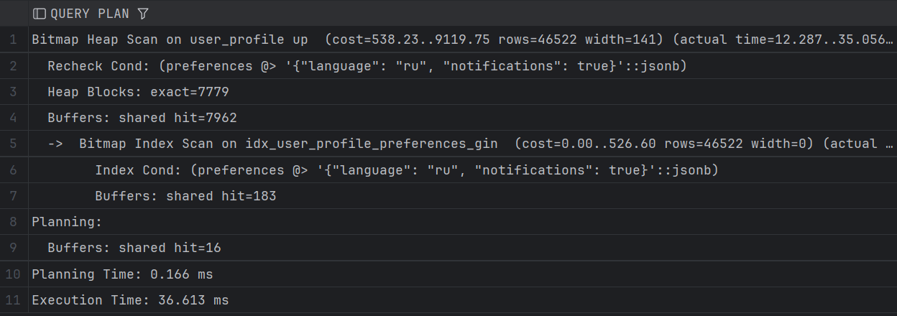

### 4) Полнотекстовый поиск по био пользователя (`user_profile.bio`)

```sql
CREATE INDEX idx_user_profile_bio_fts_gin
    ON user_profile USING GIN (to_tsvector('english', coalesce(bio, '')));
```

```sql
SELECT up.id, up.user_id, up.bio
FROM user_profile up
WHERE to_tsvector('english', coalesce(up.bio, ''))
      @@ websearch_to_tsquery('english', 'Office College');
```
Без индекса: 36344 (Seq scan)

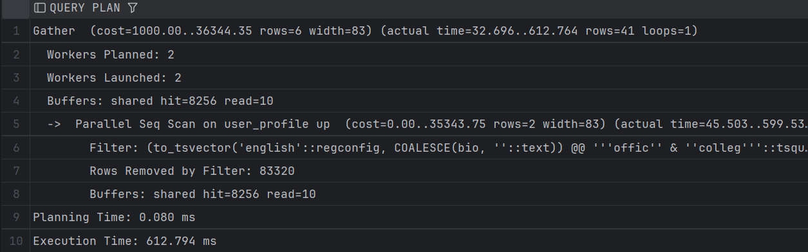

С индексом: 46.34 (Bitmap)

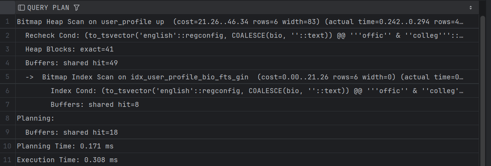

### 5) Полнотекстовый поиск по названию трека (`track.title`)

```sql
CREATE INDEX idx_track_title_fts_gin
    ON track USING GIN (to_tsvector('english', title));
```

```sql
SELECT t.id, t.title
FROM track t
WHERE to_tsvector('english', t.title)
      @@ plainto_tsquery('english', 'Night rain');
```

Без индекса: cost 42231 (Seq scan)
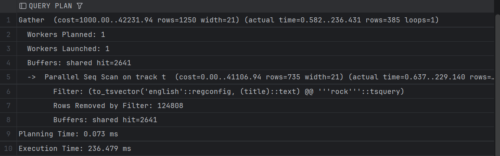

С индексом: cost 2457 (Bitmap)

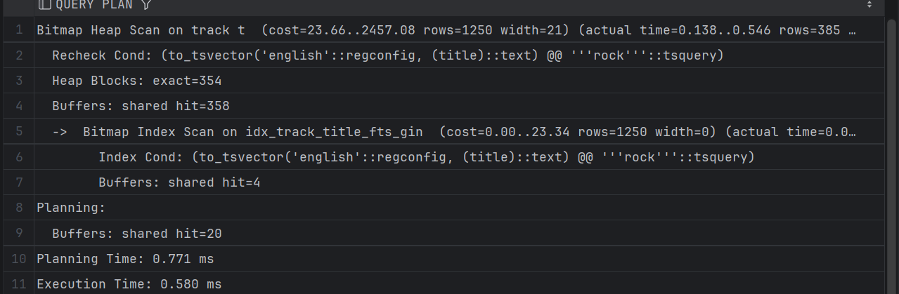


## GiST индексы

### 1 запрос

```sql
SELECT c.id, c.user_id, c.track_id, c.content
FROM comment c
WHERE to_tsvector('english', coalesce(c.content, ''))
      @@ websearch_to_tsquery('english', 'Hello');
```

Без индекса: cost 31884
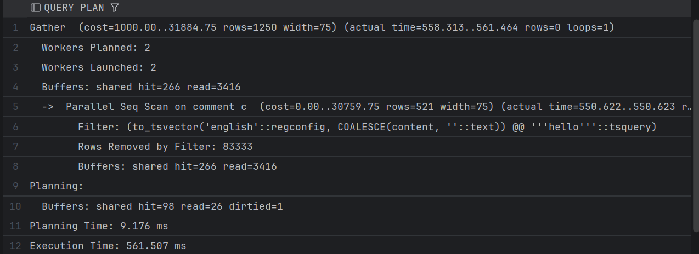

Добавляем GiST:

```sql
CREATE INDEX IF NOT EXISTS idx_comment_content_fts_gist
    ON comment USING GIST (to_tsvector('english', coalesce(content, '')));
```

С GiST индексом: cost 2842
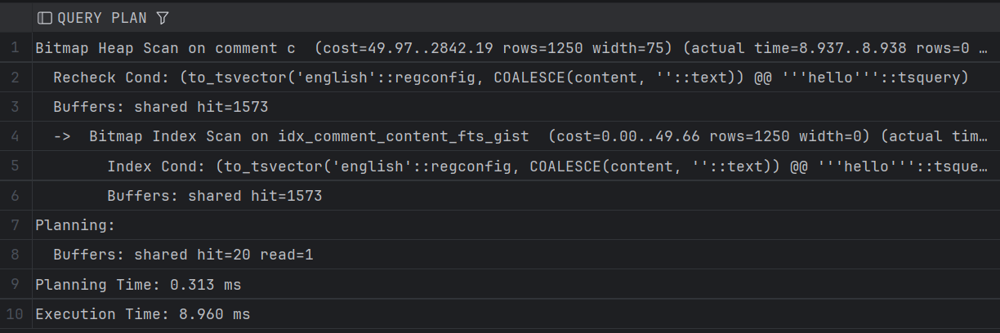

### 2 запрос

```sql
SELECT t.id, t.title
FROM track t
WHERE t.title % 'bohemian rapsody'
ORDER BY t.title <-> 'bohemian rapsody'
LIMIT 10;
```

Без индекса: cost 5343
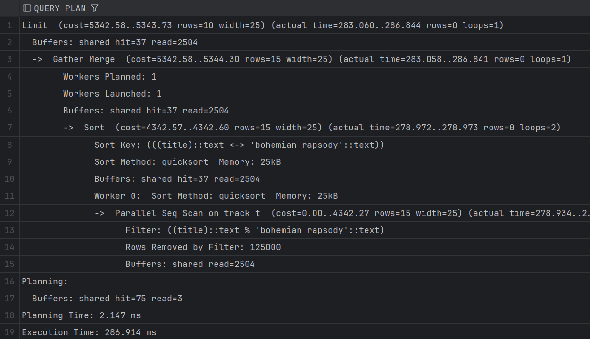

Добавляем GiST:

```sql
CREATE INDEX IF NOT EXISTS idx_track_title_trgm_gist
    ON track USING GIST (title gist_trgm_ops);
```

С GiST индексом: cost 42.11 (Index Scan)


### 3 запрос

```sql
SELECT u.id, u.username, u.email
FROM "user" u
WHERE u.username % 'amirr'
ORDER BY u.username <-> 'amirr'
LIMIT 10;
```

Без индекса: cost 5859
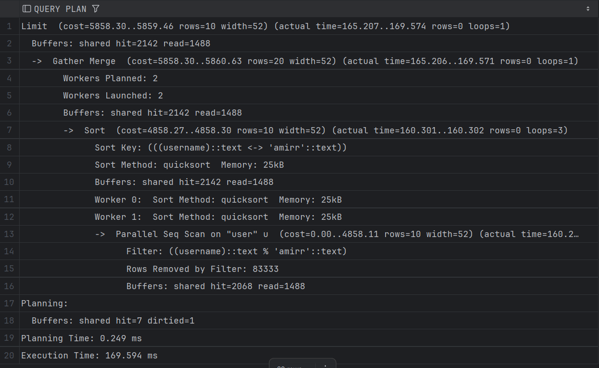

Добавляем GiST:

```sql
CREATE INDEX IF NOT EXISTS idx_user_username_trgm_gist
    ON "user" USING GIST (username gist_trgm_ops);
```

С GiST индексом: cost 42.11
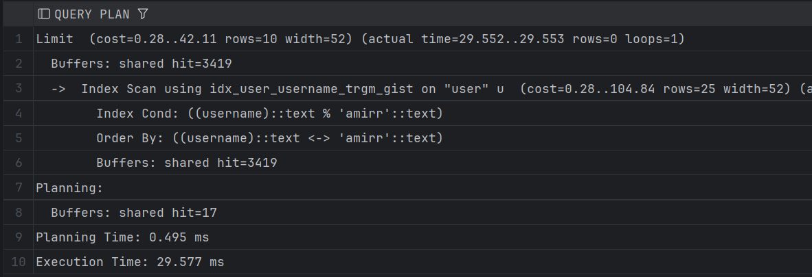

### 4 запрос

```sql
SELECT lh.id, lh.user_id, lh.track_id, lh.listened_at, lh.device
FROM listening_history lh
WHERE tsrange(lh.listened_at, lh.listened_at + interval '5 minutes', '[)')
      && tsrange(timestamp '2026-02-01 10:00:00', timestamp '2026-02-01 10:30:00', '[)');
```

Без индекса: cost 6127
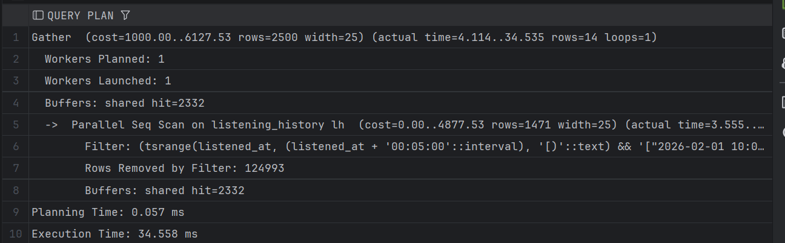

Добавляем GiST:

```sql
CREATE INDEX IF NOT EXISTS idx_listening_history_listened_window_gist
    ON listening_history USING GIST (
        tsrange(listened_at, listened_at + interval '5 minutes', '[)')
    );
```

С GiST индексом: cost 2544 (Bitmap)
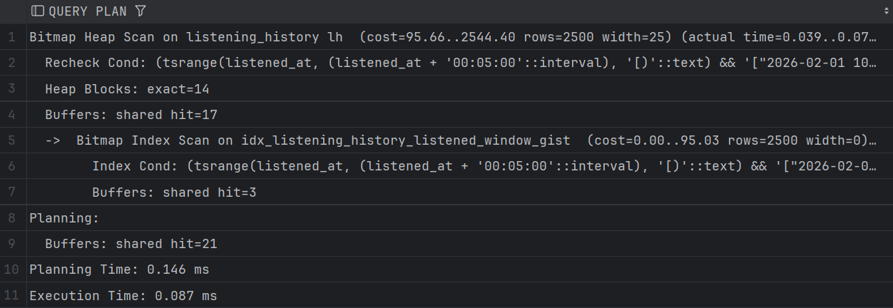

### 5 запрос

```sql
SELECT up.id, up.user_id, up.status, up.engagement_window
FROM user_profile up
WHERE up.engagement_window && int4range(200, 500, '[)');
```

Без индекса: cost 10302
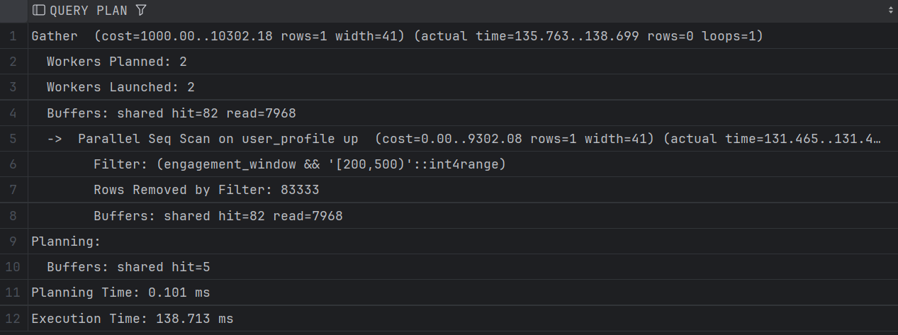

Добавляем GiST:

```sql
CREATE INDEX IF NOT EXISTS idx_user_profile_engagement_window_gist
    ON user_profile USING GIST (engagement_window);
```

С GiST индексом: cost 8.30 (Index Scan)
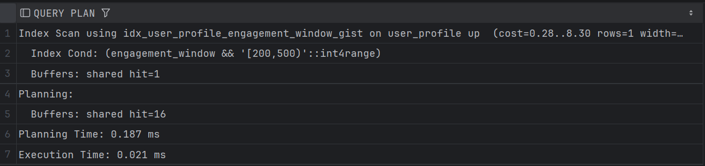

## JOIN запросы

### 1 запрос: Пользователь и его профиль

```sql
SELECT u.id, u.username, u.email, up.status, up.bio
FROM "user" u
JOIN user_profile up ON up.user_id = u.id
ORDER BY u.id
LIMIT 50;
```

Результат объединения: Merge Join. (Похоже из-за Order по user_id)
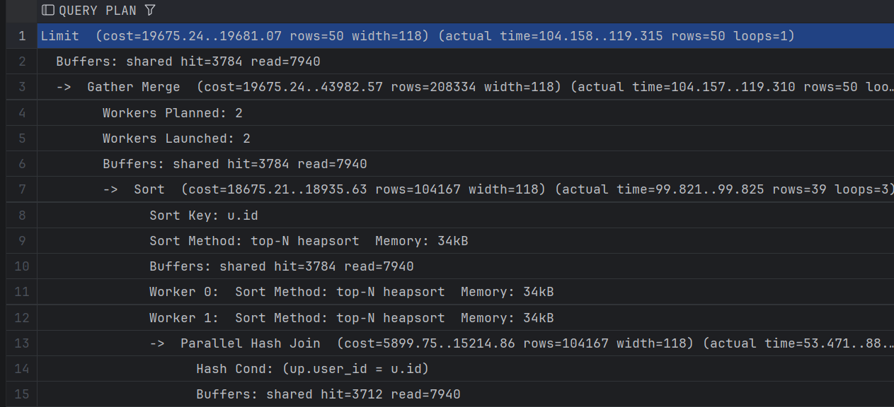

Добавил для интереса индекс на user_profile по user_id:

- Cost упал с 19681 до 11.03
- Используется Nested Loop

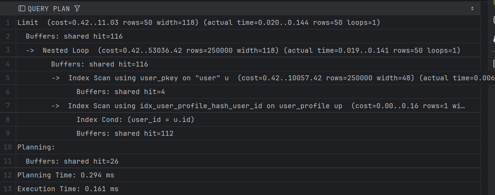


### 2 запрос: История прослушивания с пользователем и треком

```sql
SELECT lh.id, lh.listened_at, lh.device, u.username, t.title
FROM listening_history lh
JOIN "user" u ON u.id = lh.user_id
JOIN track t ON t.id = lh.track_id
ORDER BY lh.listened_at DESC
LIMIT 50;
```

Результат объединения:
- В обоих случаях Nested Loop, тк соединяем по Primary key
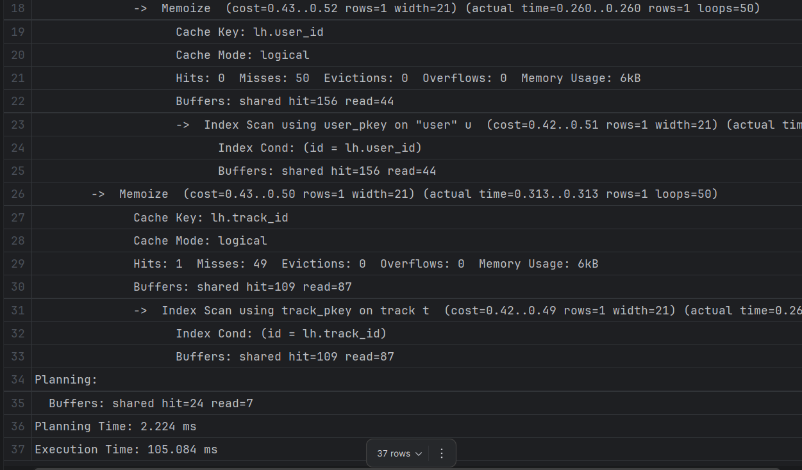

### 3 запрос: Комментарии с пользователем и треком

```sql
SELECT c.id, c.content, c.created_at, u.username, t.title
FROM comment c
JOIN "user" u ON u.id = c.user_id
JOIN track t ON t.id = c.track_id
ORDER BY c.created_at DESC
LIMIT 50;
```

Результат объединения: Nested Loop + Index Scan (по PK)
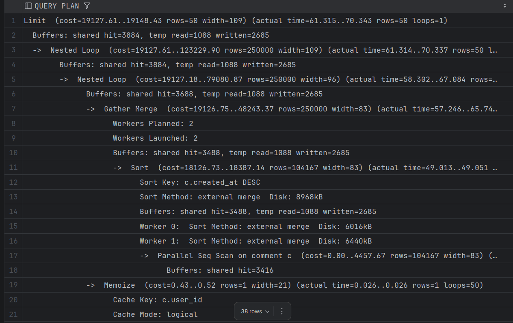

### 4 запрос: Пользователь и его прослушивания

```sql
SELECT u.id, u.username, lh.listened_at, lh.device
FROM "user" u
JOIN listening_history lh ON lh.user_id = u.id;
```
Результат объединения: Hash Join (Построил hash-таблицу по user.id и прошелся Seq Scan по lh)
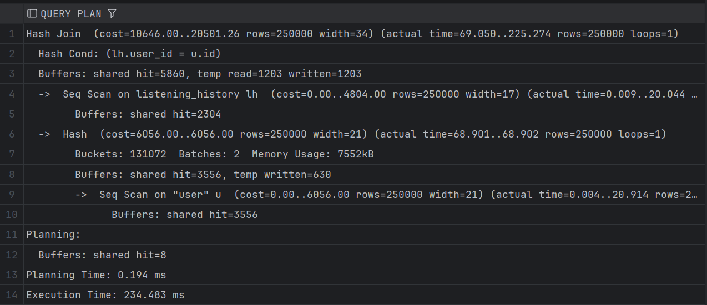

### 5 запрос: Трек и история его прослушиваний

```sql
SELECT t.id, t.title, lh.listened_at, lh.device
FROM track t
JOIN listening_history lh ON lh.track_id = t.id;
```

Результат объединения: Hash Join (хэш таблица по track.id)
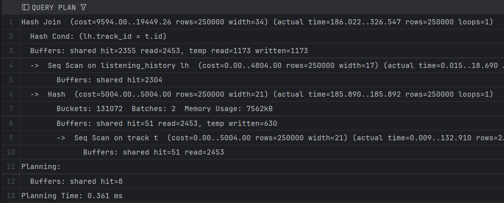
