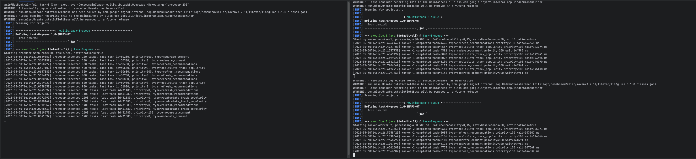
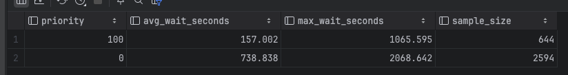
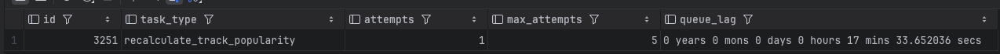
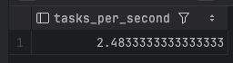

# Task 8: PostgreSQL Queue

### Выполнил задачу по реализации очереди задач на PostgreSQL

**Типы задач:**
- `refresh_recommendations`: после нового прослушивания в `listening_history` фоновый воркер пересчитывает рекомендации для пользователя.
- `recalculate_track_popularity`: после нового прослушивания воркер обновляет внутренние метрики популярности трека.
- `moderate_comment`: после создания комментария в `comment` воркер отправляет его на фоновую модерацию.

- для первых двух типов задач вставляет запись в `listening_history`;
- для `moderate_comment` вставляет запись в `comment`.
- После этого создается задача в `tasks`

**Таблица**

Таблица создается миграцией [V7__create_tasks_queue.sql](/migrations/V7__create_tasks_queue.sql).

Ключевые поля:

- `status`: `Ready`, `Running`, `Completed`, `Failed`
- `priority`: `0` для обычных задач и `100` для критических
- `attempts`, `max_attempts`: счетчик повторов
- `scheduled_at`: когда задачу можно брать в работу
- `created_at`, `started_at`, `finished_at`: метки времени для лага и аналитики
- `payload`: JSONB с контекстом задачи

Для конкурентного чтения добавлен partial index по ready-задачам и настроен более агрессивный `autovacuum`.

## Запуск

1. Поднять PostgreSQL и применить миграции:

```bash
docker compose up -d pg flyway
```

2. Собрать проект:

```bash
cd task-8
mvn compile
```

3. Запустить два воркера в разных терминалах:

```bash
mvn exec:java -Dexec.mainClass=ru.itis.db.task8.QueueApp -Dexec.args="worker worker-1"
```

```bash
mvn exec:java -Dexec.mainClass=ru.itis.db.task8.QueueApp -Dexec.args="worker worker-2"
```

4. Запустить продьюсера с высокой интенсивностью:

```bash
mvn exec:java -Dexec.mainClass=ru.itis.db.task8.QueueApp -Dexec.args="producer 200"
```

Где `200` означает 200 вставок в секунду. Для нагрузки можно использовать диапазон 100-500.

## Retry и backoff

Реализован механизм retry. Если обработка падает:

- `attempts` увеличивается на 1;
- задача возвращается в `Ready`;
- `scheduled_at` сдвигается вперед;
- задержка считается как exponential backoff: `base_delay * 2^(attempts - 1)`.
- при превышении `max_attempts` задача помечается как `Failed`.

По умолчанию `base_delay = 300` секунд, то есть первая повторная попытка будет через 5 минут.

## LISTEN / NOTIFY

Вместо постоянного polling продьюсер после успешной вставки делает:

```sql
SELECT pg_notify('tasks_channel', '<task_id>');
```

Воркеры выполняют:

```sql
LISTEN tasks_channel;
```

и ждут уведомления с таймаутом. Это снижает лишние запросы к БД, когда очередь пуста.

## Bloat и VACUUM

Для борьбы с раздуванием таблицы:

- на таблицу `tasks` выставлен более агрессивный `autovacuum`;
- во время теста можно вручную выполнить:

```sql
VACUUM ANALYZE tasks;
```

После этого можно повторно сравнить время выборки задач и лаг очереди.

# Метрики
1. Запуск воркеров и продьюсера:

2. Нагрузил 3000 задачами два воркера

Спустя некоторое время замерил метрики:
```sql
SELECT
    priority,
    ROUND(AVG(EXTRACT(EPOCH FROM (started_at - created_at)))::numeric, 3) AS avg_wait_seconds,
    ROUND(MAX(EXTRACT(EPOCH FROM (started_at - created_at)))::numeric, 3) AS max_wait_seconds,
    COUNT(*) AS sample_size
FROM tasks
WHERE started_at IS NOT NULL
GROUP BY priority
ORDER BY priority DESC;
```


Получили, что **среднее ожидание для приоритета 100 значительно меньше, чем для приоритета 0**

```sql
SELECT
    NOW() - MIN(created_at) AS queue_lag
FROM tasks
WHERE status = 'Ready';
```



Для самой старой задачи в статусе `Ready` лаг составляет 00:17:33, так как она возвращалась в очередь с retry=5 мин  

```sql
SELECT
    COUNT(*) / 60.0 AS tasks_per_second
FROM tasks
WHERE status = 'Completed'
  AND finished_at >= NOW() - INTERVAL '60 seconds';
```



Пропускная способность воркера - 2.5 сек
