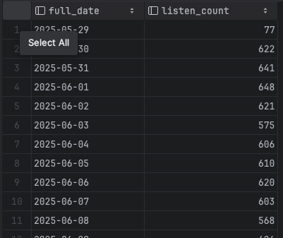
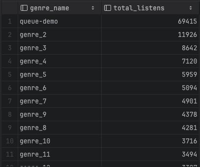
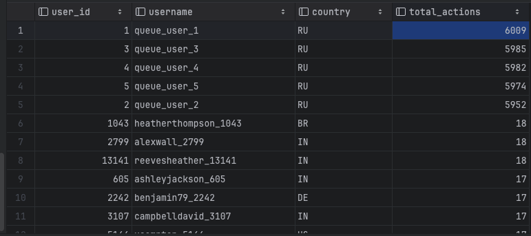
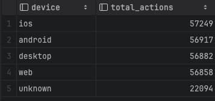
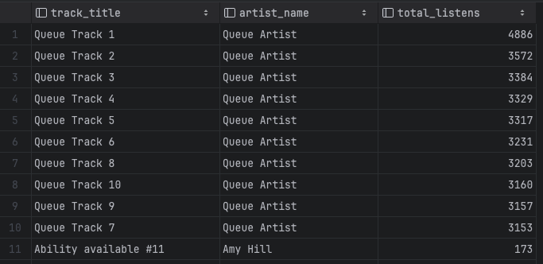

# Задание 9. OLAP-модель для музыкального сервиса

## 1. Актуальная OLTP-схема

Основные бизнес-таблицы проекта:

- `subscription`
- `user`
- `playlist`
- `artist`
- `genre`
- `album`
- `track`
- `listening_history`
- `like`
- `comment`
- `follow`
- `track_profile`
- `user_profile`
- `tasks`

Для аналитики по пользовательской активности лучше всего подходит таблица `listening_history`, потому что:

- в ней уже есть событие действия пользователя;
- есть дата и время события `listened_at`;
- есть пользователь `user_id`;
- есть сущность, с которой связано действие, `track_id`;
- есть дополнительный аналитический признак `device`.

## 2. Аналитические вопросы

Для проекта выбраны такие аналитические вопросы:

1. Какая динамика прослушиваний по дням?
2. Какие треки и жанры самые популярные?
3. Сколько действий совершают пользователи и с каких устройств?

## 3. Главный факт и зерно

Главный факт: `olap.fact_user_actions`

Зерно факта:

- `1 строка = 1 прослушивание трека одним пользователем`

Это означает, что каждая запись из `listening_history` превращается в одну запись фактовой таблицы.

## 4. Измерения

Были созданы 4 измерения:

- `olap.dim_date`
- `olap.dim_user`
- `olap.dim_track`
- `olap.dim_genre`

## 5. DDL: создание схемы и OLAP-таблиц

OLAP схема создана в migrations/V8__add_olap_schema.sql

## 6. Загрузка OLAP-таблиц из OLTP

Данные загружены в task-9/olap.sql

## 7. Аналитические запросы

Ниже приведены аналитические запросы к построенной OLAP-модели. Они отвечают на выбранные бизнес-вопросы проекта.

### 1. Динамика активности по дням

Запрос:

```sql
SELECT
    dd.full_date,
    COUNT(*) AS listen_count
FROM olap.fact_user_actions fua
JOIN olap.dim_date dd
    ON dd.date_key = fua.date_key
GROUP BY dd.full_date
ORDER BY dd.full_date;
```

Что показывает:

- сколько прослушиваний было в каждый день;
- есть ли рост или падение активности пользователей;
- в какие дни сервис используется чаще.

Почему запрос аналитический:

- данные уже агрегируются не по OLTP-таблице `listening_history`, а по факту `fact_user_actions`;
- дата берется из измерения `dim_date`, что удобно для дальнейшей аналитики по месяцам, кварталам и дням недели.

### 2. Самые популярные жанры

Запрос:

```sql
SELECT
    dg.genre_name,
    COUNT(*) AS total_listens
FROM olap.fact_user_actions fua
JOIN olap.dim_genre dg
    ON dg.genre_key = fua.genre_key
GROUP BY dg.genre_name
ORDER BY total_listens DESC, dg.genre_name;
```

Что показывает:

- какие жанры чаще всего слушают пользователи;
- какие категории контента дают больше всего событий;
- какой музыкальный контент наиболее востребован.

Почему запрос аналитический:

- используется измерение `dim_genre`, в котором уже собраны атрибуты жанра;

### 3. Сколько действий совершают пользователи

Запрос:

```sql
SELECT
    du.user_id,
    du.username,
    du.country,
    COUNT(*) AS total_actions
FROM olap.fact_user_actions fua
JOIN olap.dim_user du
    ON du.user_key = fua.user_key
GROUP BY du.user_id, du.username, du.country
ORDER BY total_actions DESC, du.user_id;
```

Что показывает:

- сколько прослушиваний совершил каждый пользователь;
- кто является самым активным пользователем;
- как распределяется активность между пользователями.

Почему запрос аналитический:

- он позволяет оценить пользовательскую вовлеченность;

### 4. Активность по устройствам

Запрос:

```sql
SELECT
    COALESCE(fua.device, 'unknown') AS device,
    COUNT(*) AS total_actions
FROM olap.fact_user_actions fua
GROUP BY COALESCE(fua.device, 'unknown')
ORDER BY total_actions DESC, device;
```

Что показывает:

- с каких устройств пользователи чаще слушают музыку;
- какая платформа использования наиболее популярна;
- есть ли доля событий без заполненного устройства.

Почему запрос полезен:

- помогает анализировать сценарии использования сервиса;
- может быть полезен для продуктовых решений, связанных с мобильными и desktop-платформами.

### 5. Самые популярные треки

Запрос:

```sql
SELECT
    dt.track_title,
    dt.artist_name,
    COUNT(*) AS total_listens
FROM olap.fact_user_actions fua
JOIN olap.dim_track dt
    ON dt.track_key = fua.track_key
GROUP BY dt.track_title, dt.artist_name
ORDER BY total_listens DESC, dt.track_title;
```

Что показывает:

- какие треки пользователи слушают чаще всего;
- какие исполнители попадают в топ по прослушиваниям;
- какой контент является самым популярным внутри сервиса.

Почему запрос аналитический:

- измерение `dim_track` объединяет сведения о треке, альбоме и исполнителе;
- запрос подходит для построения рейтингов и рекомендаций.
